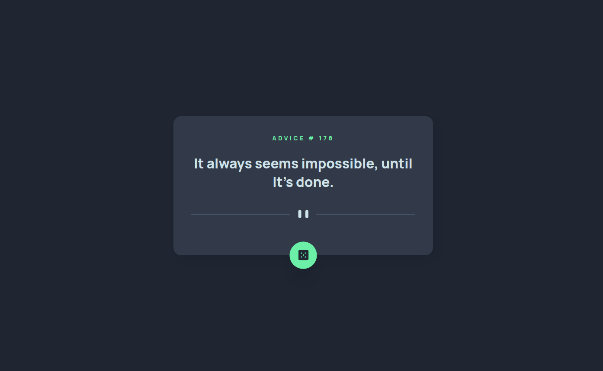
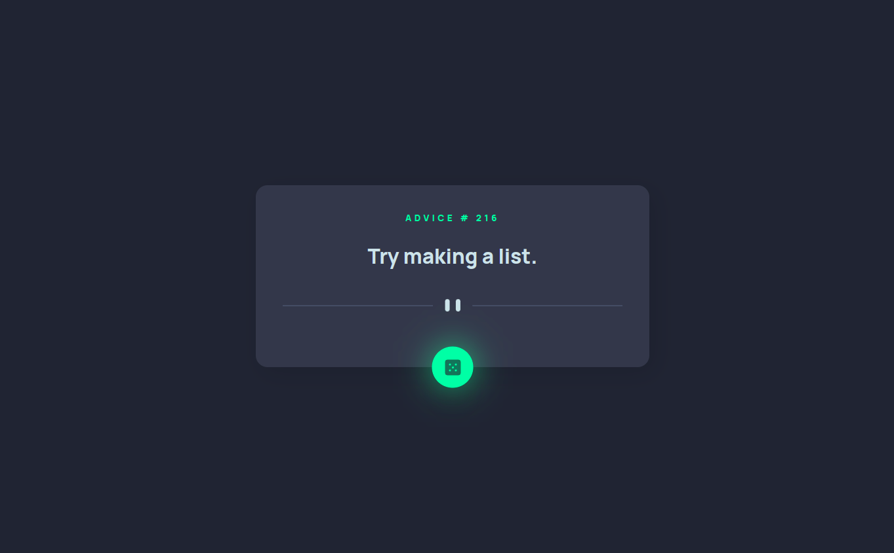

# Frontend Mentor - Advice generator app solution

This is a solution to the [Advice generator app challenge on Frontend Mentor](https://www.frontendmentor.io/challenges/advice-generator-app-QdUG-13db). Frontend Mentor challenges help you improve your coding skills by building realistic projects.

## Table of contents

- [Overview](#overview)
    - [The challenge](#the-challenge)
    - [Screenshot](#screenshot)
    - [Links](#links)
- [My process](#my-process)
    - [Built with](#built-with)
    - [What I learned](#what-i-learned)
- [Author](#author)

**Note: Delete this note and update the table of contents based on what sections you keep.**

## Overview

### The challenge

Users should be able to:

- Fetch advice from an API at a click of a button
- Design a user adaptive and user friendly responsive UI

### Screenshot




### Links

- Solution URL: [Add solution URL here](https://github.com/Nathanielanum/advice-generator-frontend-mentor)
- Live Site URL: [Add live site URL here](https://nathanielanum.github.io/advice-generator-frontend-mentor/)

## My process

- Project setup and codebase organisation
- HTML markup and CSS style implementation
- Functionality implementation

### Built with

- Semantic HTML5 markup
- CSS custom properties
- Flexbox
- CSS Grid
- Mobile-first workflow
- Javascript


### What I learned

The glow effect on the button hover

```html
<button class="button" id="button"></button>
```
```css
.button:after {
  content: "";
  width: 80%;
  height: 80%;
  transform: translate(-50%, -50%);
  position: absolute;
  top: 50%;
  left: 50%;
  background: var(--primary-clr);
  border-radius: inherit;
  filter: blur(calc(var(--spacing-lg) - var(--spacing-md)));
  opacity: 0;
}
.button:hover::after {
  opacity: 1;
  transition: all .5s ease;
}
.button:not(:hover)::after {
  transition: all .5s ease;
}
```

## Author

- Website - [Nathaniel Anum Adjah](https://nathanielanum.github.io/advice-generator-frontend-mentor/)
- Frontend Mentor - [@Nathanielanum](https://www.frontendmentor.io/profile/Nathanielanum)
- Twitter - [@NathanielAnum99](https://www.twitter.com/NathanielAnum99)